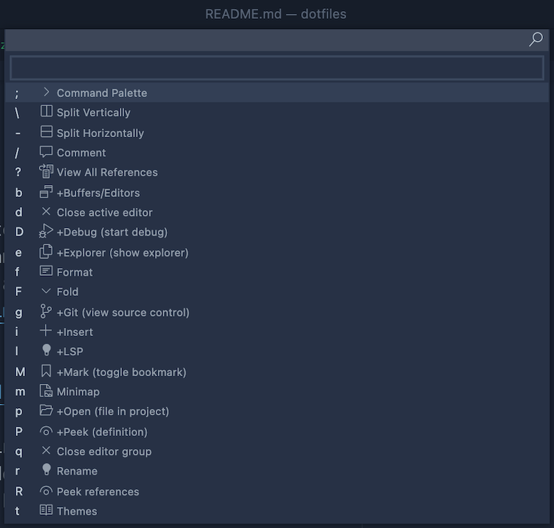

# Dotfiles


Clone this repo to your `$XDG_CONFIG_HOME` directory as it relies on that fact
in order to source different files in `dotfiles/zsh/.zshrc`. I recommend setting
your `$XDG_CONFIG_HOME` equal to `$HOME/.config` in order to alleviate `$HOME`
clutter.

```zsh
git clone https://github.com/j2udevelopment/dotfiles.git $XDG_CONFIG_HOME
```

When using this repo on a work machine, I keep a `$HOME/.zshrc` that sources my
`$XDG_CONFIG_HOME/dotfiles/zsh/zshrc`. This allows me to add any aliases,
functions, exports, etc that may contain proprietary information without
impacting my open source dotfiles. An example of a `$HOME/.zshrc` file for a
work machine:

```zsh
[[ -f $XDG_CONFIG_HOME/dotfiles/zsh/.zshrc ]] && source $XDG_CONFIG_HOME/dotfiles/zsh/.zshrc

### Exports with potentially proprietary information ###
export FOOBAR="/foo/bar"
### Aliases with potentially proprietary information ###
alias foobar="foo bar"
### Functions with potentially proprietary information ###
fooBar() {
  foo bar $1 $2 $3
}
### Other potentially proprietary information ###
...
```

I typically copy my `dotfiles/zsh/.zshrc` to `$HOME/.zshrc` when initially
provisioning a new environment.

Also included in this repo is a simple bash CLI, `dfm` (dotfiles manager) that I
use to help provision new development environments... which is admittedly a
little overkill I'll be the first to admit; however, it serves as an example of
how to build a simple CLI with Bash. As I explore new tools, I add installation
functions to `dfm` that I try to make compatible with Mac (what I typically use
for native development) and Ubuntu (what I typically use for dev containers).

## [Docker Dotfiles](https://hub.docker.com/repository/docker/j2udevelopment/dev-env)

I have also containerized this setup so that it can be run anywhere. The only
pre-requisite would be installing Nerd Fonts (or a similar font package) as
detailed below. Depending on your environment and terminal of choice, that step
can vary quite a bit, but I promise it's worth it!

I recommend attaching to the container with the Visual Studio Code
[Remote - Containers](https://marketplace.visualstudio.com/items?itemName=ms-vscode-remote.remote-containers)
extension and using the integrated terminal whenever possible; however, you can
also attach to the container and use a terminal editor (like vim 😎) from the
command line.

```bash
docker run -it \
  --network host \
  --name ubuntu-dev-env \
  -v /var/run/docker.sock/:/var/run/docker.sock \
  -v <PATH_TO_FOLDER_YOU_WANT_TO_MOUNT>:/root/dev \
  j2udevelopment/dev-env /bin/zsh
```

## [Oh My Zsh](https://ohmyz.sh/)

Oh My Zsh is a framework for managing Zsh configuration and has an easy-to-use
plugin system. See the link above for installation instructions or install it
with `dfm`.

```zsh
dfm install zsh
```

## [Powerlevel10k](https://github.com/romkatv/powerlevel10k)

Powerlevel10k is, objectively, the best command prompt theme for Zsh... until
it's not. See the link above for installation instructions or install it with
`dfm`.

```zsh
dfm install p10k
```

If the default theme doesn't suit your tastes you can run the Powerlevel10k
configuration wizard.

```zsh
p10k configure
```

## [Nerd Fonts](https://github.com/ryanoasis/nerd-fonts)

In order to use the custom symbols and command prompt from my themes, you'll
need to install Nerd Fonts (or some similar font package). You can either
install it yourself or let the p10k configuration wizard do it for you. See the
link above if you'd like to install it yourself. You'll need to update the font
in your terminal of choice or in the
[settings.json](dotfiles/vscode/settings.json) if using VSCode's integrated
terminal.

To let the p10k configuration wizard do the font installation, run the below and
follow the prompt until it installs the needed fonts:

> Note: you do not need to go through the entire configuration wizard. Simply
> answer yes when prompted about installing the `MesloLGS NF` font.

```zsh
p10k configure
```

If you choose this option, the `MesloLGS NF` should be automatically selected
from the font dropdown. Either of the above font packages will work well.

## [Neovim](https://neovim.io/)

TODO: Recently, Neovim has changed to have better Lua support and native
[LSP](https://neovim.io/doc/user/lsp.html). I am currently reworking my Neovim
configuration, but will likely be taking a look at
[Lunar Vim](https://github.com/LunarVim/LunarVim) for inspiration.

## [Visual Studio Code](https://code.visualstudio.com/)

I use VSCode for any development that is more involved than simply making quick
changes. Neovim _can_ be turned into a full-fledged IDE, but I have found
sticking with VSCode for most things works out better from a team perspective.
Being able to configure a dev container
([devcontainer.json](https://code.visualstudio.com/docs/remote/devcontainerjson-reference))
and share user/workspace settings
([settings.json](https://code.visualstudio.com/docs/getstarted/settings#_settings-file-locations))
is so much more user-friendly than asking my teammates to make heads or tales of
my more complicated Neovim configuration. With that being said, to get my Vim
fix in VSCode, I've been using the
[Vim](https://marketplace.visualstudio.com/items?itemName=vscodevim.vim) and
[Which Key](https://marketplace.visualstudio.com/items?itemName=VSpaceCode.whichkey)
extensions. My keybindings for each can be found in
[settings.json](dotfiles/vscode/settings.json). My leader key is space and
unfortunately I could not get the leader to trigger Which Key without breaking
Sneak/EasyMotion functionality; therefore, the backspace key will trigger Which
Key.

### Which Key

My current Which Key setup is shown below. Options with a `+` will open a new
menu with sub options. Every other option has an equivalent leader key
combination (so instead of backspace + key you can use leader (space) + key).
Options that have a `+` will mention what their leader key functionality is in
parentheses (if there is a leader key equivalent). For example, instead of
pressing `<backspace>` + `e` and getting the submenu of options to show various
panels in the sidebar, you can press `<space>` + `e` to open the explorer
directly.



## [FZF (command-line fuzzy finder)](https://github.com/junegunn/fzf)

FZF is an awesome command line fuzzy finder that can be using in a variety of
ways. I most often use it for searching my command history with `ctrl` + `r` and
for recursive file searching with `ctrl` + `t`, but you can use it for so much
more. You can pipe any command with output to FZF.

```zsh
dfm install fzf
```
