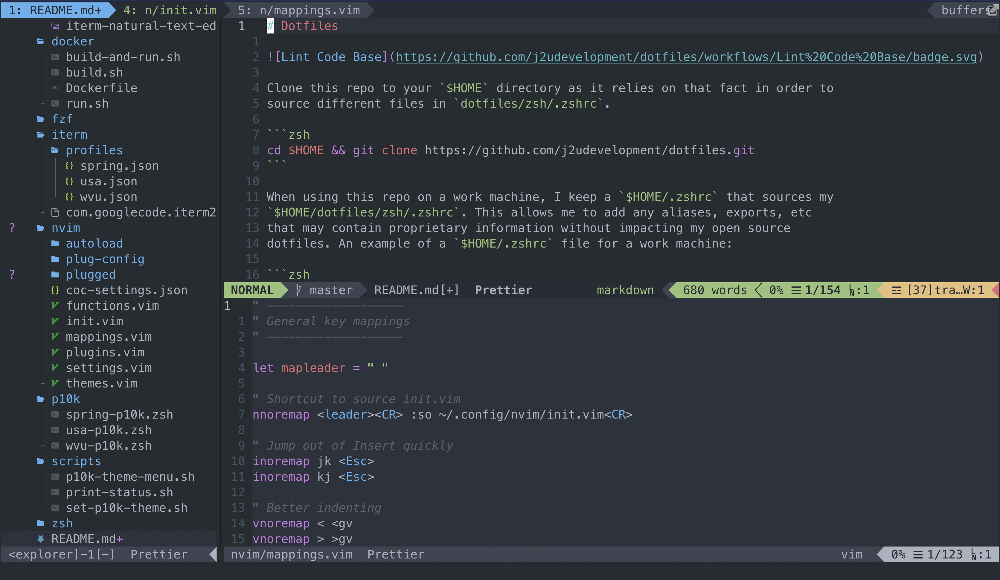

# Dotfiles


Clone this repo to your `$HOME` directory as it relies on that fact in order to
source different files in `dotfiles/zsh/.zshrc`.

```zsh
cd $HOME && git clone https://github.com/j2udevelopment/dotfiles.git
```

When using this repo on a work machine, I keep a `$HOME/.zshrc` that sources my
`$HOME/dotfiles/zsh/.zshrc`. This allows me to add any aliases, exports, etc
that may contain proprietary information without impacting my open source
dotfiles. An example of a `$HOME/.zshrc` file for a work machine:

```zsh
[[ -f $HOME/dotfiles/zsh/.zshrc ]] && source $HOME/dotfiles/zsh/.zshrc

### Exports with potentialy proprietary information ###
export FOOBAR="/foo/bar"
### Aliases with potentialy proprietary information ###
alias foobar="foo bar"
### Other potentially proprietary information ###
...
```

## [Docker Dotfiles](https://hub.docker.com/repository/docker/j2udevelopment/dev-env)

I have also containerized this setup so that it can be run anywhere. The only pre-requisite would be installing Nerd Fonts as detailed below. Depending on your environment and terminal of choice, that step can vary quite a bit, but I promise it's worth it!

By running the below, you can mount a directory into a hackable Ubuntu environment with my dotfiles setup:

```bash
docker run -it \
        --network host \
        --name ubuntu-dev-env \
        -v /var/run/docker.sock/:/var/run/docker.sock \
        -v <PATH_TO_FOLDER_YOU_WANT_TO_MOUNT>:/root/dev \
        j2udevelopment/dev-env /bin/zsh
```

## [iTerm2](https://www.iterm2.com/)

iTerm is my terminal of choice. You can install it with:

```zsh
brew cask install iterm2
```

Import the desired iterm profile theme from the `dotfiles/iterm/profiles`
folder.  
You will need to update the font after installing Nerd Fonts in subsequent
steps.

The iTerm profiles in this repository take advantage of natural text editing.
You can jump backward or forward by a word with option + &#8592; or &#8594;
respectively. You can jump to the beginning or end of a line with cmd + &#8592;
or &#8594; respectively. You can combine these jumps with delete or backspace.


## [Oh My Zsh](https://ohmyz.sh/)

Oh My Zsh is a framework for managing Zsh configuration and has an easy-to-use
plugin system. You can install it with:

```zsh
sh -c "$(curl -fsSL https://raw.github.com/ohmyzsh/ohmyzsh/master/tools/install.sh)"
```

## [Powerlevel10k](https://github.com/romkatv/powerlevel10k)

Powerlevel10k is the best command prompt theme for Zsh. Change my mind. You can
install it with:

```bash
git clone --depth=1 https://github.com/romkatv/powerlevel10k.git ${ZSH_CUSTOM:-~/.oh-my-zsh/custom}/themes/powerlevel10k
```

Run the following function defined in `dotfiles/zsh/functions.zsh` to set a
preconfigured Powerlevel10k command prompt:

```zsh
theme
```

or run the following in order to use the Powerlevel10k configuration wizard:

```zsh
p10k configure
```

## [Nerd Fonts](https://github.com/ryanoasis/nerd-fonts)

In order to use the custom symbols and command prompt from my themes, you'll
need to install Nerd Fonts. You can either install them yourself or let the p10k
configuration wizard do it for you.

To manually install run the below:

```zsh
brew tap homebrew/cask-fonts
brew cask install font-hack-nerd-font
```

If you choose this option, you'll need to manually set the font in your iTerm
preferences. Open iTerm preferences with:  
`cmd + ,` and go to Profiles -> Text -> Font  
Select `Hack Nerd Font Mono` from the dropdown.

To let the p10k configuration wizard do the font installation, run the below and
follow the prompt until it installs the needed fonts:

> Note: you do not need to go through the entire configuration wizard. Simply
> answer yes when prompted about installing the `MesloLGS NF` font.

```zsh
p10k configure
```

If you choose this option, the `MesloLGS NF` should be automatically selected
from the font dropdown. Either of the above font packages will work well.

Restart iTerm.

## [Neovim](https://neovim.io/)

Neovim is a better version of Vim. My Neovim config is admittedly very tailored to
my personal preferences, but others are welcome to give it a go. My plugins, key mappings, and settings can be found in `nvim/plugins.vim`, `nvim/mappings.vim`, and `nvim/settings.vim` respectively. A screenshot of my current nvim setup is shown below.



## [LSD(LSDeluxe)](https://github.com/Peltoche/lsd)

LSD is a pretty nifty tool that adds symbols to directories, files, etc. It
makes use of the aforementioned Nerd Fonts. You can install it with:

```zsh
brew install lsd
```

## [FZF (command-line fuzzy finder)](https://github.com/junegunn/fzf)

FZF is an awesome command line fuzzy finder that can be using in a variety of
ways. I most often use it for searching my command history, but you can use it
for so much more. You can pipe any command with output to FZF. I also make use
of this tool in Vim. You can install it with:

```zsh
brew install fzf
```

## [Autojump](https://github.com/wting/autojump)

Autojump is an awesome tool that remembers the directories that you've visited
and allows you to revisit them without typing out the entire path. For example,
if I've visited the `/foo/bar/baz` directory in the past and quickly want to
jump back to it, I can simply run:

```zsh
j baz
```

You can install it with

```zsh
brew install autojump
```
